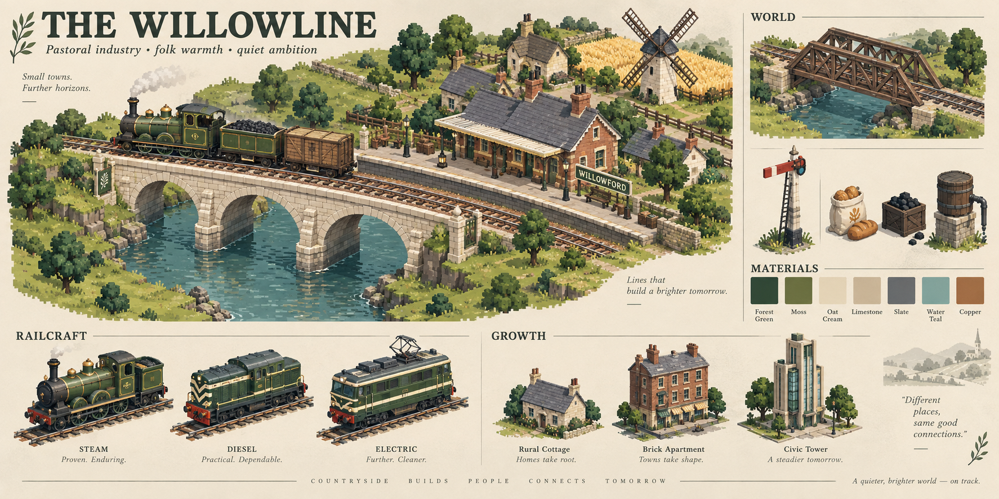
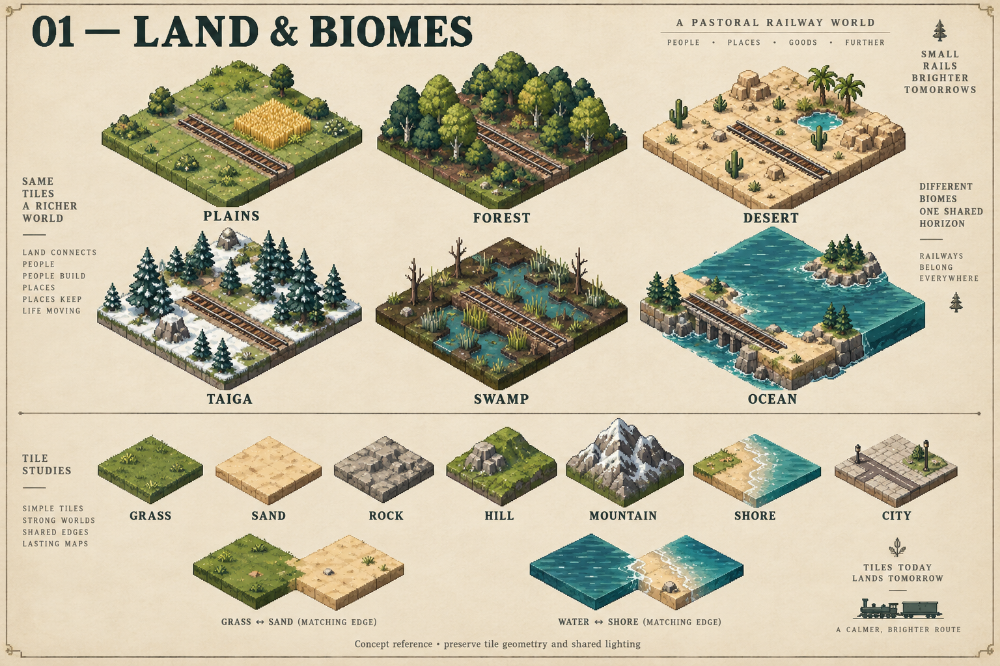
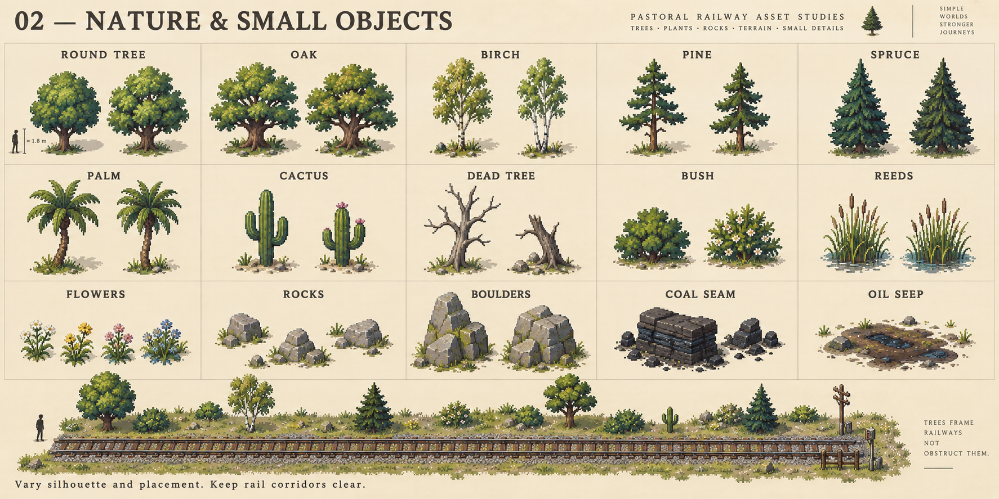
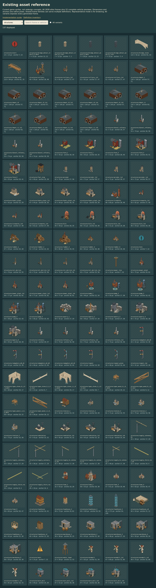
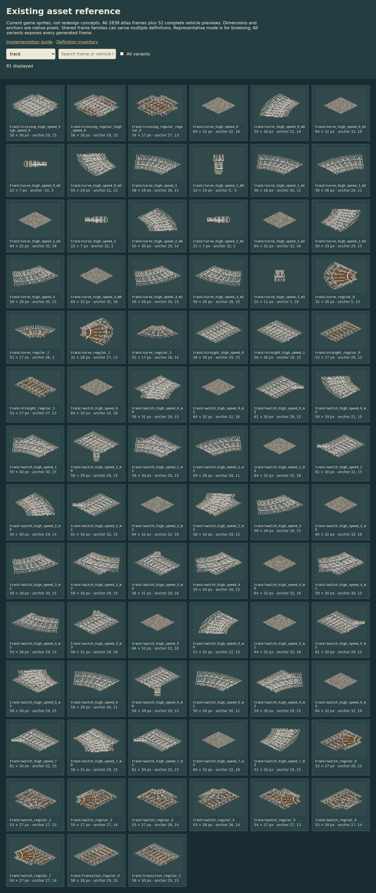
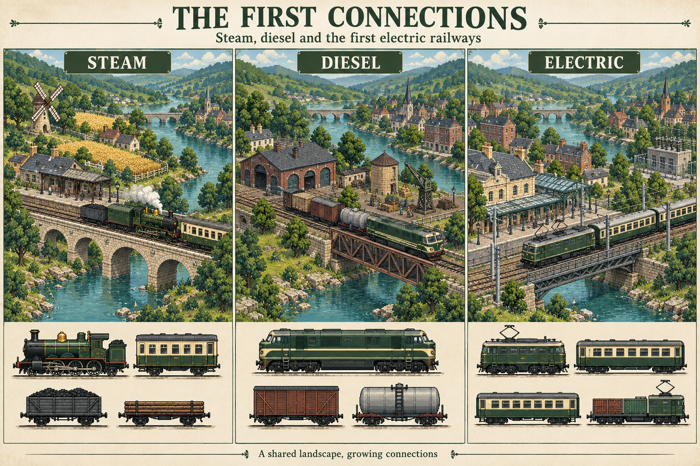
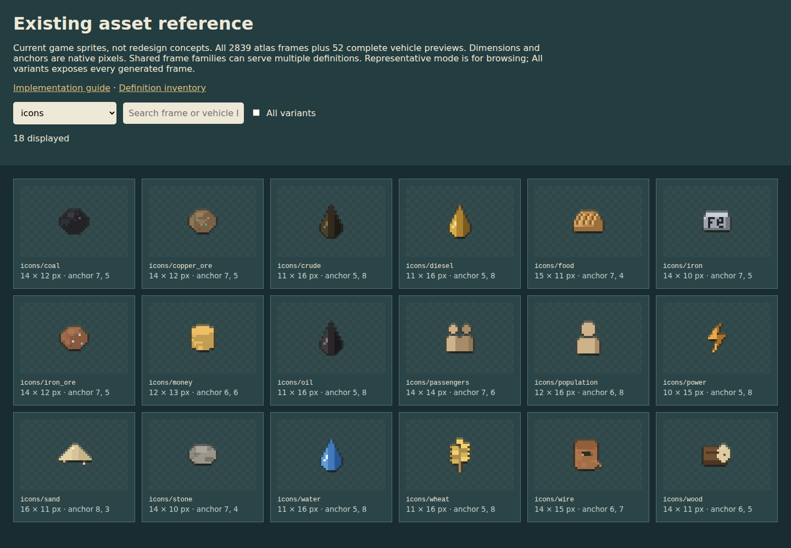
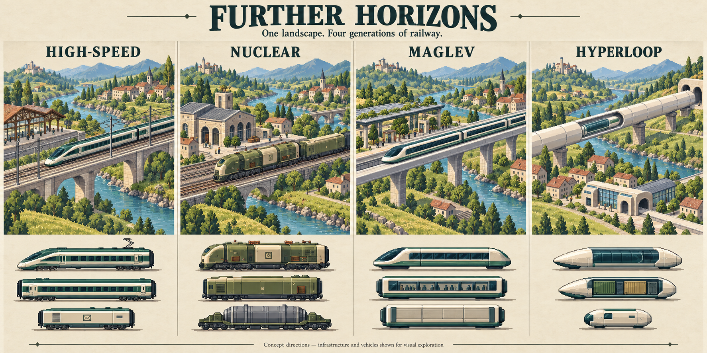

# Asset redesign implementation guide

Pastoral industry, folk warmth and quiet ambition. The railway grows from timber and steam
into refined electrical infrastructure while its countryside and town identity remain familiar.

Prepared against repository commit `5b66cbd`. This is a proposed visual implementation guide,
not a gameplay change or an instruction to replace the existing simulation. The current game
has Steam, Diesel and Electric ages; high-speed is a later electric visual stage. Nuclear,
maglev and hyperloop are future concepts, not existing asset requirements.

## How to use this pack

- [Searchable current asset catalog](asset-catalog.html): all **2,839 atlas frames**, plus
  **52 complete vehicle previews**. Choose a group, search an ID, or enable All variants.
- [Definition inventory](asset-inventory.md): every shipped locomotive, wagon, biome,
  station, works building, decor item and cargo definition, including full-chain mode.
- [Frame inventory](frame-inventory.json): exact names, groups, native dimensions and anchors.
  These are packed, transparency-trimmed frame dimensions and pixel anchors; a 64×32
  generator canvas can therefore appear narrower in the catalog without changing tile size.
- Images titled concept/reference describe the intended direction. Images prefixed `current-`
  are actual existing sprites, regenerated from the atlas whenever the generators change. They
  now show the redesigned art; the pre-redesign baseline sheets are the `art-*-before.png` files
  in `scratchpad/`, listed in `scratchpad/README.md`.
- Work from the written geometry and functionality rules when a concept picture disagrees.
  Generated pictures contain mixed detail scales, invented joinery, illustrative track layouts
  and occasional incorrect running gear. Do not trace those errors into production assets.

## 1. Shared production rules

| Topic       | Implementation rule                                                                                                                                                                      |
| ----------- | ---------------------------------------------------------------------------------------------------------------------------------------------------------------------------------------- |
| Projection  | Preserve 2:1 isometric projection and 64×32 base tiles. Existing elevation step is 10 px.                                                                                                |
| Pixel scale | Draw world assets in native logical pixels; use nearest-neighbour scaling for previews. Do not mix smooth painted foliage with hard pixel vehicles. Camera motion can remain continuous. |
| Form        | Prioritise silhouette, then major panels, then material detail. Use broad colour clusters, not independent noise on every pixel.                                                         |
| Light       | One upper-left light convention. Roofs/top faces lightest; away-facing walls darkest. Use three or four shades per material.                                                             |
| Edges       | Selective dark lower/occluded edges. Avoid a black outline around every terrain diamond or every brick. Transparent margins must not contain coloured fringes.                           |
| Contact     | Ground shadows touch trunk/building bases. Rails sit on sleepers and ballast. Bridge piers enter water; no detached shadows or floating support feet.                                    |
| Scale       | Preserve gameplay footprint and clearance. A tall building can grow vertically, but its artwork must not imply an extra occupied tile.                                                   |
| Variation   | Deterministic seeded variations in silhouette, clusters and roof detail. Keep anchors and connection endpoints identical across variants.                                                |
| Clarity     | Trains and rails strongest; operational buildings next; scenery quietest. Status indicators must remain visible over every biome.                                                        |
| Delivery    | Keep procedural generation and existing frame contracts; no new runtime dependencies. Concept PNGs are reference material, not runtime sprite replacements.                              |

Proposed palette seeds, to tune together in `src/art/palette.ts`: forest `#294638`, moss
`#78804C`, oat `#E4D5B5`, limestone `#BCA98B`, slate `#626B6C`, water `#477B82`, copper
`#A36B42`. Preserve distinct brighter semantic colours for warning, danger, selection and valid
placement. These are suggested base colours, not an instruction to recolour all stock green.
Use restrained oxblood, midnight blue, ochre and industrial orange for livery variety.

## 2. Terrain, biomes and tile joins

The display-block thickness in this concept sheet is illustrative. Do not add raised edges to
ordinary ground tiles. Snow patches and shoreline blends are proposed treatments; do not infer
new snow mechanics or terrain types from them. Wheat remains a farm motif, not a decoration
painted onto every plains tile. The ocean panel's railway is a bridge, not track laid on water.

| Existing biome | Target appearance                                                                  | Readability constraint                                                                     |
| -------------- | ---------------------------------------------------------------------------------- | ------------------------------------------------------------------------------------------ |
| Plains         | Moss/meadow greens, broad quiet patches, sparse wildflowers.                       | Leave large open grass areas; fields only around farms.                                    |
| Forest         | Dark leaf litter, rounded broadleaf clusters, clear trunk openings.                | Ballast must separate tracks from the dark ground; trees stand back from rail corridors.   |
| Desert         | Oat/ochre sand, warm rock, sparse cactus and occasional oasis palm.                | Keep sand less bright than selection indicators; no continuous high-contrast dune stripes. |
| Taiga          | Cooler blue-green conifers, subdued lichen ground. Optional cosmetic snow accents. | Distinguish pine and spruce by shape, not just colour.                                     |
| Swamp          | Peat greens, shallow teal pockets, reeds and occasional deadwood.                  | Shallow wet ground must remain distinct from actual unbuildable water.                     |
| Ocean          | Quiet teal water, limited horizontal glints, sandy and rocky shores.               | Do not texture it so strongly that bridge feet or moving trains disappear.                 |

Cover all terrain frame families: `grass`, `forest`, `rock`, `hillcut`, `sand`, `plains`,
`taiga`, `swamp`, `desert`, `water`, `hill`, `mountain`, `void`, `city`, and the interaction
overlays. Keep the four ground variants, three water variants with four animation frames,
and three hill/mountain/void variants present in the catalog.

- **Rock / mountain:** rock is low exposed stone; mountains have unmistakable raised mass.
  Preserve impassability and elevation anchors. Hillcut is flattened earth, not a second hill.
- **Shore joins:** redesign with shared edge coordinates. Blend masks are a proposed renderer
  extension, not a reason to paint arbitrary coastlines into every water tile. Test all neighbour
  combinations; never introduce gaps or paint over the track clearance area.
- **Water animation:** move a few highlights across four frames. No large pulsing brightness.
  Match the water hue used in submerged bridge shading.
- **City tiles:** neutral paving and narrow connected streets. Preserve the current 3×3 visual
  phase pattern and its continuous joins. The existing population-density trigger remains
  gameplay-owned; art does not convert additional terrain or introduce roads with path rules.
- **Void / locked fog:** subdued map-edge treatment distinct from ocean and buildable land.

[Current terrain sheet](images/current-terrain.png) · Source: `src/art/terrain.ts`,
`src/render/worldRenderer.ts`, `src/data/biomes.json`.

## 3. Trees, plants and natural objects

Use this sheet for silhouette and material relationships. Its leaf detail and human scale marker
are illustrative; retain the game's established compressed sprite scale. Simplify leaf clusters
before drawing individual twigs. Bare sprites should not acquire large square soil bases.

| Existing family    | Recognisable shape / treatment                                                           |
| ------------------ | ---------------------------------------------------------------------------------------- |
| `tree`             | Round broadleaf crown; two or three connected canopy masses.                             |
| `oak`              | Wider and heavier than round trees; strong branching and low spreading crown.            |
| `birch`            | Slender pale trunk, airy uneven canopy; dark trunk breaks sparingly.                     |
| `pine`             | Open tiered canopy with visible trunk between groups.                                    |
| `spruce`           | Denser tapered cone; darker lower layers.                                                |
| `palm`             | Small fan of readable fronds on bent trunk; sparse desert/oasis accent.                  |
| `cactus`           | Clear ribbed column/arm silhouette; few highlights.                                      |
| `deadtree`         | Bare branching silhouette; do not reuse the living tree with foliage merely tinted grey. |
| `bush`             | Low two- or three-lobed cluster; shorter than train body.                                |
| `reeds`            | Sparse upright stems with a grounded wet base.                                           |
| `flowers`          | Four restrained colour variants, concentrated in tiny clusters.                          |
| `rock` / `boulder` | Small low stones versus larger angular masses; consistent stone lighting.                |
| `coal`             | Dark stratified outcrop, distinguishable from ordinary grey rock.                        |
| `oil`              | Small dark seep with restrained sheen; no bright rainbow pool.                           |

Preserve three variants for tree/pine/rock/birch/spruce/oak/cactus/bush/boulder/coal/oil;
two for palm/deadtree/reeds; four for flowers. Change silhouette as well as shade. Check
placement near curves and signals: clearing a prop must remove its entire visual, and trunk
anchors must remain attached to the correct tile. Seasonal recolours are optional future work.

[Current props sheet](images/current-props.png) · Source: `src/art/props.ts`.

## 4. Civic buildings, stations and housing

The theme board's growth strip establishes the proposed materials. The following sheet shows
the **current** buildings, levels, construction states and service art to redesign.

| Definition / role            | Proposed primary silhouette                                        | Upgrade language                                                                                             |
| ---------------------------- | ------------------------------------------------------------------ | ------------------------------------------------------------------------------------------------------------ |
| Station (`station`)          | Passenger canopy, platform edge, readable station sign.            | Larger canopy, better frontage, additional existing platform treatment. Retain five levels.                  |
| Townhouse (`town`)           | Civic frontage, clock gable or small central tower, modest square. | More substantial civic wings. No passenger platform or passenger icon.                                       |
| House (`townhouse` decor ID) | Residential windows, door and domestic roof.                       | Cottage → low-rise apartments → high-rise → slender masonry/glass skyscraper. Capacities stay 20/60/140/300. |
| Warehouse                    | Broad loading doors, stacked crates, short loading canopy.         | More bays and better handling equipment; keep footprint.                                                     |
| Depot                        | Two-track engine shed with clearly open train portals.             | Timber/brick → iron spans → refined service hall; preserve all four orientations and gate clearances.        |
| Farm Halt                    | Barn, modest wheat patch, sacks and loading edge.                  | Larger barn/silo and tidier yard, not an unrelated factory.                                                  |
| Lumber Yard                  | Log stacks, saw shed, handling frame.                              | More organised stacks, covered sawline and better crane.                                                     |
| Quarry                       | Excavated rock face, pale stone heaps, lifting frame.              | Larger machinery and sorting bays inside the existing visual footprint.                                      |
| Water Pump                   | Intake pipe, pump house and small tank.                            | Clearer machinery and improved intake housing. Distinct from a service water tower.                          |

`mine`, `sand_pit` and `copper_mine` currently share quarry art in full-chain mode. Proposed
distinctive cues: dark ore bins/headframe for iron, pale low heaps for sand, warm copper ore
accents and a sorting shed for copper. Adding dedicated families requires updating art lookup;
it does not require new building IDs or changed recipes.

House construction frames `townhouse_s0/s1/s2` must show foundation → frame/scaffold → roof
work, all on the final building anchor. Do not confuse these construction stages with upgrade
levels. Keep scaffold contrast below operating signals. Taller assets need an occlusion check
beside rails; selection fading, if needed, is separate renderer work.

Sources: `src/art/structures.ts`, `src/art/industry.ts`, `src/art/civic.ts`,
`src/data/stations.json`, `stations_full.json`, `houses.json`, `decor.json`.

## 5. Works buildings and production objects

Use cream foundations, warm brick, slate, iron machinery and restrained copper details.
The process must read from one dominant object; recipes remain represented by UI icons.
Generic extra chimneys are not sufficient to distinguish every works upgrade.

| Existing building                       | Required identifying feature                                   | Proposed level 2–4 progression                                                                      |
| --------------------------------------- | -------------------------------------------------------------- | --------------------------------------------------------------------------------------------------- |
| Windmill                                | Four-sail mill, grain sacks and flour/bread cue.               | Stronger base, enclosed handling annex, refined sails and machinery; remain recognisable as a mill. |
| Charcoal Kiln                           | Low rounded/domed kiln, stacked wood, controlled dark opening. | More substantial kiln housing and covered wood handling.                                            |
| Stone Grinder                           | Broad crushing rollers/jaws, hopper, pale aggregate.           | Additional conveyor/covered sorting unit; no mine headframe.                                        |
| Oil Refinery                            | Tank, compact distillation column and connected pipes.         | More structured pipe racks and processing units.                                                    |
| Power Plant                             | Boiler/turbine hall, one clear stack, electrical yard.         | Larger hall and cleaner, better organised electrical equipment.                                     |
| Substation                              | Transformer block and ceramic insulators in a low fenced yard. | Additional transformer/insulator assemblies.                                                        |
| Hydro Plant                             | Water intake and turbine house with visible outflow cue.       | Better intake gate and larger turbine housing; preserve shore placement rules.                      |
| Colliery                                | Dark coal bins, headframe or sorting tower.                    | Covered screens and improved loading plant.                                                         |
| Ironworks                               | Furnace mass, muted warm opening and ingot staging.            | Larger furnace enclosure and organised handling bays.                                               |
| Oil Derrick                             | Strong triangular pump/derrick silhouette, small tank.         | Reinforced frame and organised tank/pump assembly.                                                  |
| Full-chain Refinery (`diesel_refinery`) | Shares refinery art today; use the same material family.       | Distinguish its UI product icon; a separate asset is optional, not required to imply new mechanics. |
| Wire Mill                               | Drawbench/roller hall, large copper wire reels.                | Covered production line and larger neatly stacked reels.                                            |

Keep levels 1–4 and native anchors. Production props include piles, sacks/bales, logs, crates,
barrels, silos, chimneys, pipes, cranes and fences embedded in building generators. Redesign
these shared helpers once so stations and works agree. They are not all independently placeable
buildings. Smoke is a restrained effect, never a permanent opaque cloud hiding the rail yard.

Sources: `src/art/industry.ts`, `src/art/civic.ts`, `src/data/buildings.json`,
`src/data/buildings_full.json`.

## 6. Track, bridges, services and electricity

| Family                      | Art direction                                                               | Invariant                                                                                        |
| --------------------------- | --------------------------------------------------------------------------- | ------------------------------------------------------------------------------------------------ |
| Regular rail                | Warm timber sleepers, neutral ballast, clear steel railheads.               | Existing gauge, endpoints and 1×1 curve/switch geometry.                                         |
| High-speed rail             | Pale concrete sleepers, tidier ballast, same coherent steel.                | 2×2 curves/switches, radius 1.5 tiles; unused member still reads as occupied apron.              |
| Switches                    | Small purposeful point mechanism; routes remain legible.                    | Every rotation and handedness connects exactly.                                                  |
| Crossings                   | Clear interleaved railheads and restrained sleeper texture.                 | Regular/regular, regular/high-speed and high-speed/high-speed variants.                          |
| Transition                  | Gradual sleeper/material change along one track.                            | Class transition, not an extra curve or platform.                                                |
| Wooden bridge               | Connected timber truss, real bracing and grounded piers.                    | Independent platform, then ordinary track; preserve span phases, both axes and upgrades.         |
| Stone bridge                | Continuous cream masonry arch, thicker supports, restrained joints.         | Same independent platform behaviour; art does not change capacity or clearance.                  |
| Water tower                 | Banded timber tank, stone/wood legs, recognisable water spout.              | Service structure, not a passenger building.                                                     |
| Coaling Stage (`fuel_stop`) | Coal bunker and chute/handling arm.                                         | Distinct from water tank and production colliery.                                                |
| Semaphore                   | Slim readable post, distinct arm silhouette and lamp.                       | Preserve every `semaphore_m*_d*` state and the renderer's orientation; colour plus arm position. |
| Third rail                  | Low insulated conductor beside track.                                       | Does not become an extra running rail or obscure switch route.                                   |
| Catenary / HV               | Slender posts, simple wires and insulators; HV structurally differentiated. | Contact height, live-state cues and route overlays remain functional.                            |
| Power line                  | Timber utility poles and restrained wire spans.                             | Distinguish supply network from railway overhead wires.                                          |

The old `bridge` track kind remains in the data/art path for compatibility. Do not reintroduce
it as the primary build workflow. Preserve any needed legacy frame while redesigning the
independent platforms. Near bridge rails/parapets must occlude correctly; rear supports stay
behind the train. Test connected spans, lone decks, both directions and construction previews.

Electrical wires, selection overlays and connection lines also include runtime-drawn geometry;
the atlas catalog alone is not the whole system. Review `src/sim/catenary.ts`,
`src/render/powerLines.ts`, `src/render/worldRenderer.ts`, and the corresponding train overlays.

## 7. Locomotives, wagons and cargo overlays

[Current complete vehicle sheet](images/current-complete-vehicles.png) contains every one of
the 32 locomotive and 20 wagon definitions. The catalog's complete previews assemble body
parts and running gear; raw atlas frames often show only a part. Do not mistake a partial
frame for a missing vehicle. The definition inventory lists every ID and current body family.

| Existing body family | Redesign instructions                                                                                                   |
| -------------------- | ----------------------------------------------------------------------------------------------------------------------- |
| `steam_early`        | Simple exposed boiler, tall chimney, timber/brass character. Keep the differences in existing paint and proportions.    |
| `steam_std`          | Strong boiler/cab/tender masses, sparse handrails and fittings. Preserve each model's configured articulation and size. |
| `steam_streamlined`  | Continuous shroud, distinctive nose and livery; still visibly steam stock.                                              |
| `steam_garratt`      | Separate engine units and central bridge/boiler mass. Connections remain visibly articulated.                           |
| `diesel_switcher`    | Short purposeful hood, distinct cab, workhorse proportions.                                                             |
| `diesel_hood`        | Long hood, walkways and ventilation groups; retain body length and bogie count.                                         |
| `diesel_cab`         | Strong cab/nose silhouette, coherent side panel rhythm.                                                                 |
| `electric_box`       | Angular cab, roof equipment and collector appropriate to definition.                                                    |
| `electric_crocodile` | Distinct long noses and articulated central cab; do not merge into a generic box.                                       |
| `electric_hs`        | Refined nose and coordinated passenger-era materials. An evolution of electric, not maglev.                             |

Stock without separate bogies retains **two fixed axles / four wheels**, in the same wheel style.
Separate `bogie` frames have two axles/four wheels; `bogie3` has three axles/six wheels.
`engine_unit` remains a distinct articulated mechanism. Do not infer axle count from a concept
image. Geometry stays in `vehicleSpec` and rigid-body posing: one sprite per rigid segment,
independent bogie motion, no curved slicing or artificial hinges. Keep 48 facings and the
existing mirrored/residual-rotation treatment. Art must not change compatibility verdicts.

| Wagon family / definitions                               | Defining visual cue                                                                        |
| -------------------------------------------------------- | ------------------------------------------------------------------------------------------ |
| Water Cart; Riveted, Welded and Pressure Tanks           | Cylindrical tank, age-specific bands/seams and fittings; same liquid role.                 |
| Wooden Hopper, Steel Hopper, Bathtub, Bottom-Dump Hopper | Open top and clear side-wall shape; stronger handling/discharge details through ages.      |
| Flatbed, Bolster Flat, Bulkhead Flat, Heavy Flat         | Low deck; distinct bolsters, end bulkheads or reinforced load bed.                         |
| Wooden Coach, Steel Coach, Pullman                       | Window rhythm, doors and roof form; preserve individual length and livery.                 |
| Brake Van                                                | Compact enclosed body with a visibly different end/cabin treatment from a passenger coach. |
| Plank Boxcar                                             | Broad cargo door and planked enclosed sides.                                               |
| Coal Cart, Fuel Cart, Battery Cart                       | Open coal bin, small fuel vessel, or enclosed battery housing; unmistakable service role.  |

Cargo overlays `heap`, `logs`, `bales`, `crates` use the same materials as world stockpiles.
Keep loads inside wagon walls and below practical clearance; liquids and passengers should
not receive a generic heap. Validate empty, partial and full loads where represented, including
reverse motion and coupled vehicles stopped on curves.

Sources: `src/art/rolling.ts`, `src/art/frames.ts`, `src/sim/body.ts`,
`src/render/trainRenderer.ts`, `src/ui/spritePreview.ts`.

## 8. Resource icons, people, paths and effects

Icons currently use 16×16 buffers. Keep a strong single silhouette with a selective outline,
not a miniature painting. Use the same object meaning in tooltips, recipes, cargo and inventory.

| Icon set                   | Proposed visual distinction                                                                            |
| -------------------------- | ------------------------------------------------------------------------------------------------------ |
| Water / wheat / food       | Drop or water vessel / tied wheat ears / recognisable bread loaf. Food must never look like raw wheat. |
| Wood / stone / coal / iron | Cut logs / faceted pale blocks / dark lumps / clean ingots.                                            |
| Iron ore / copper ore      | Rough mineral chunks, differentiated from refined iron and wire.                                       |
| Oil / crude / diesel       | Consistent vessel family with distinct silhouette marking and tint; labels remain available.           |
| Sand / wire                | Pale loose mound / copper spool with visible centre hole.                                              |
| Power / money              | Clear bolt / coin, brighter than scenery details.                                                      |
| Passengers / population    | Travel figure/bag versus grouped residents; do not rely on colour alone.                               |

Cargo definitions include both supply modes; power, money and population also have icons even
though they are not ordinary wagon cargo. Keep all 18 existing icon frames.

[Current people and paths](images/current-people.png) · [Current effects](images/current-fx.png).

- **People:** four current outfits, two walk frames, 6×12 buffers. Readable head/body/legs,
  subdued worker and resident clothing, consistent ground anchor. Further appearance variety
  is optional; preserve existing bounded population rendering and animation.
- **Paths:** dirt paths, stone roads, and both crossing families in their current variants.
  Shared seams and kerbs; crossings must not paint out railheads or invent a road transport mode.
- **Weather:** rain is fine and low contrast; fog is translucent; smoke drifts in soft stepped
  clusters. Preserve frame anchors and avoid opaque rectangles on transparent backgrounds.
- **Light:** light-tile, glow and small glow should blend with warm lamps without washing out
  signal colours. Controlled effect alpha is allowed; it is not an excuse to blur structural sprites.
- **Interaction:** cursor, valid/invalid ghost, selection, warning/alert/note and locked fog must
  work on bright sand, dark forest and city paving. Pair colour with outline/shape or text.
- **Runtime UI:** floating numbers, overview markers, track previews, power overlays and
  selection outlines also need theme review. Keep numeric text crisp, and do not bake it into PNGs.

Sources: `src/art/icons.ts`, `src/art/people.ts`, `src/art/fx.ts`, `src/render/fx.ts`,
`src/render/floaters.ts`, `src/render/overviewRenderer.ts`, `src/ui/`.

## 9. Future visual continuity — not existing inventory

High-speed develops the electric family with streamlined shapes and lighter infrastructure.
Fictional nuclear stock can be broad and substantial; maglev uses a distinct guideway and no
wheel bogies; hyperloop introduces enclosed tubes with selected cutaways. Keep cream masonry,
landscape colours and town landmarks. These concepts require separate gameplay and renderer
design before production; do not silently add them to this redesign's asset count.

## 10. Implementation order and acceptance

1. **Baseline:** preserve this catalog and current screenshots. Capture atlas generation times,
   dimensions and startup timing on the same machine used for after measurements.
2. **Shared materials:** update palette and common shape/texture helpers. Build a small scene
   with rail, water, a tree, station, House, windmill and one moving train.
3. **Terrain and vegetation:** complete quiet ground, consistent edges and track clearance.
4. **Rail and structures:** finish both bridge classes, service art, electrical geometry,
   civic roles and every upgrade/construction stage. Test occlusion with moving trains.
5. **Stock:** redesign by body family, then validate all definition/paint/size combinations.
6. **UI and effects:** derive complete previews from the actual atlas, then polish icon and
   status readability. Avoid separate inaccurate vehicle illustrations in crafting.
7. **Whole-world review:** normal play zoom, overview and close-up; rural, city, six biomes,
   all relevant orientations, day/night, weather and dense junctions.

Acceptance checklist per family:

- Every existing key still resolves; no missing full-chain or upgrade frames. If adding keys,
  update lookup/fallbacks deliberately and regenerate the inventory.
- No clipped transparent margins, anchor shifts, neighbour seams or changed track endpoints.
- Materials agree at native scale; no isolated smooth assets or excessive texture noise.
- Identify cargo, building role and signal state without relying solely on colour.
- Bridge support water contact, vehicle occlusion and tall-building track visibility pass.
- Rigid bodies retain bogie movement and configured wheel counts; reversal and curve fixtures
  still pass. Do not revive superseded full-silhouette masking or body slicing decisions.
- Atlas dimensions/frame count and measured generation/startup cost remain within an agreed
  budget. Use roughly one second generation as the prior aspiration, not an unmeasured claim.
- Run typecheck, lint and applicable simulation/render regression fixtures after code edits.
  Save before/after scenes with identical seed, camera, zoom and lighting.

Regenerate the current reference catalog with `node scratchpad/build-art-guide.mjs` while the
development server is available at `127.0.0.1:5173`. It opens an isolated new-game context,
disables autosave, exports all frames and checks that every image resolves. Open
`asset-catalog.html` locally; it is standalone and needs no network or external dependencies.

## Image provenance and concept prompts

The five concept PNGs were produced with the built-in image-generation tool; current sheets
were rendered from the game's atlas through its existing sprite preview function. No generated
concept is loaded by the game. Further civic/industry image generation failed with a service
404; existing concept material plus complete current structure sheets support those sections.

See [concept-prompts.md](concept-prompts.md) for the prompt specifications used for the two
new sheets and a description of the three previously approved boards reused here.
