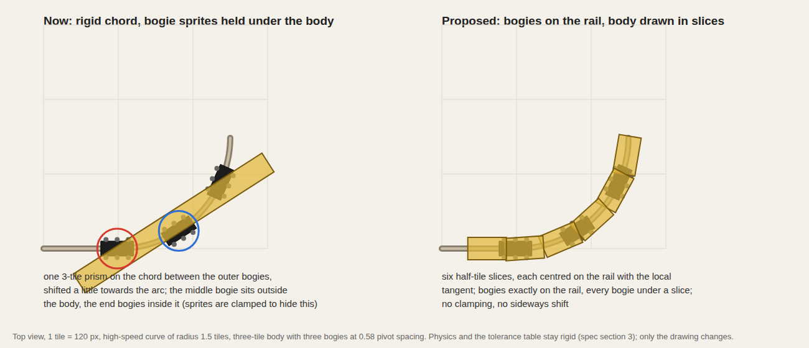

# Bogies and bodies on curves: the target model

What the drawing of a vehicle must do, written down after the first playtest so the next pass
implements it once. Section numbers refer to `current-phase-spec.md`; the decisions already taken
are in `phase-decisions.md` and stay in force where this note does not override them.

## Rules

1. **Bogies are always on the rail and follow it.** A bogie is drawn at its exact arc position
   on the track polyline with the local tangent as its heading. No clamping to the body, no
   sideways hold (`BOGIE_DRAW_PLAY` goes). The physics side already does this; the drawing must
   match it.
2. **The body is drawn on the rail too, in slices.** A body longer than half a tile is drawn as
   slices of at most 0.5 tile, each slice centred on the polyline at its own arc position with
   the local tangent (its own facing out of the 48, its own residual rotation). A three-tile body
   is six slices, a two-tile body four, the Garratt cradle three, the Meyer frame six. Small
   (one-tile) stock keeps its single sprite with baked wheels. With half-tile slices the sag
   between a slice and the arc is 0.02 tiles on the high-speed curve (R 1.5) and 0.06 on the
   regular curve (R 0.5), against a body half-width of 0.13 to 0.15: every bogie lies under a
   slice on every curve the model may run on.
3. **The rigid body model stays where it belongs: in the tolerance table.** `poseSegment` (spec
   section 3) still poses the rigid chord, measures the fore-and-aft slide, sideways shift,
   residual gap and centre-bogie offset, and `compat.ts` still bans models from a class on those
   numbers. Nothing in the tolerance verdicts changes. The chord, the sideways shift and the
   mean-gap centring are no longer used for drawing.
4. **A consist never rotates in place.** A reversal keeps every sprite's facing and moves the
   train backwards along the same polyline. The trail polyline is kept as it is on reversal
   (point order reversed, arc positions re-indexed), never rebuilt from the path, so the poses
   before and after the flip are identical to the pixel. The renderer's `+π` on `reversed` stays
   the only facing correction. A train that must change direction does so only through
   `reverse()`; no dispatch, retreat or park-aside may re-pose the consist in a way that turns
   the sprites.
5. **Depth order.** Bogie sprites take their own slice's depth key minus one; slices take the
   depth key of their own arc position. Bogies are never sorted by their own position (a bogie
   nearer the camera than the body centre painted over the body before).

## Art

- Slices are generated by the same part drawers as today, through a `Frame` that carries a clip
  range `[l0, l1]` along the body. Every primitive (`prism`, `cyl`, `boiler`, `cab`, `windows`,
  `dot`, `chimney`, `dome`, `lamp`, `pantograph`, `underframe`) intersects its extent along `l`
  with the range and skips or shortens itself; the drawer code does not change. Frame names:
  `rolling/loco_{body}_{size}_{paint}_{part}_s{k}_f{facing}`, `rolling/wagon_{body}_{size}_{paint}_s{k}_f{facing}`.
- Bogie sprites stay shared: `bogie` (two axles, 0.30 long), `bogie3` (three axles, 0.44),
  `engine_unit` (Meyer, 0.70). `bogieAxles: 3` in the data selects `bogie3`.
- Atlas budget: a slice is a fraction of a body, so the pixel area per model stays about the
  same; the frame count grows by the slice count. Measure generation time; it must stay near 1 s.

## Verification

- Mask test (scratchpad script): for every medium and large model, over
  `compat.referencePath(cls)` at 0.05-tile steps, render the slices and bogies for one frame and
  assert every opaque bogie pixel lies under an opaque slice pixel. Run for both classes the
  model may use.
- Reversal test: pose a consist on a curve, call `reverse()`, and assert every vehicle's drawn
  position and facing is unchanged.
- Screenshots of a large rigid diesel, a Garratt and a Big Boy mid-curve on high-speed track,
  and a medium tender engine on the regular curve, before and after.
